<p align="center">
  
</p>

<p align="center">
  
</p>

---

# Profile

> *I bridge the gap between autonomous deep learning systems, physical hardware control loops, and high-performance backend pipelines.*
>
> I am an undergraduate Computer Science student specializing in AI/ML engineering, distributed backend development, and robotics. My work focuses on training specialized transformer architectures, designing scientific workflow orchestrators (like SciFlow), and modeling medical image reproduction algorithms (VitalML). I build low-level performance pipelines and robotics control systems leveraging ROS2 and Gazebo.

---

# Architecture & Domains

### THE THEORETICAL
<p align="left">
  
  
  
  
  
</p>

### THE TACTICAL
<p align="left">
  
  
  
  
  
  
  
  
  
</p>

### THE ORCHESTRATION
<p align="left">
  
  
  
  
  
  
  
</p>

---

# Active Registry Entries (Projects)

```
[DIR] VitalML-Reproduction  --  Reproduction of medical imaging models.
[DIR] OneIITP-Chatbot       --  Autonomous assistant framework.
[DIR] SciFlow               --  Scientific workflow automation.
[DIR] Transformer-Step      --  Interactive PyTorch transformer architecture.
[DIR] Flux-Shortener        --  High-throughput URL compression system.
```

---

# Telemetry Statistics

<p align="center">
  
  
</p>

<p align="center">
  
</p>

<p align="center">
  
</p>

---

# Diagnostic Metrics

<p align="center">
  
</p>

---

# Terminal Connections

<p align="center">
  
</p>
