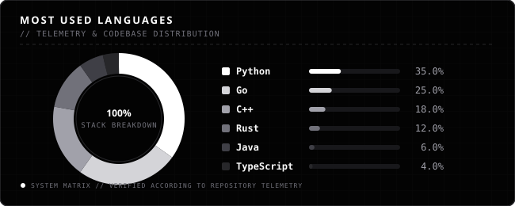

<p align="center">
  
</p>

<h1 align="center">
  <a href="https://github.com/6sLOGAN78">
    
  </a>
</h1>

<p align="center">
  <code>AI/ML SYSTEMS</code> &nbsp;•&nbsp; <code>HIGH-PERFORMANCE BACKENDS</code> &nbsp;•&nbsp; <code>CONCURRENT ARCHITECTURES</code>
</p>

<p align="center">
  <a href="#-cat-profilesys">Profile</a> •
  <a href="#-cat-languagesdistribution">Languages</a> •
  <a href="#-git-snake--view">Contribution Snake</a> •
  <a href="#-system-stack">Stack</a> •
  <a href="#-projects--list">Projects</a> •
  <a href="#-spotify--now-playing">Spotify</a> •
  <a href="#-telemetry--diagnostics">Telemetry</a>
</p>

---

## ┌──[ `$ cat profile.sys` ]

> *I bridge the gap between autonomous deep learning systems and high-performance backend pipelines.*

```json
{
  "developer": "6sLOGAN78",
  "focus_areas": ["AI/ML Systems", "High-Performance Backend", "Low-Level Optimization"],
  "core_languages": ["Python", "Go", "C++", "Rust", "Java"],
  "architecture_patterns": ["Transformer Networks", "Concurrent Microservices", "Distributed Pipelines"],
  "status": "BUILDING_AUTONOMOUS_INFRASTRUCTURE"
}
```

---

## ┌──[ `$ cat languages.distribution` ]

<p align="center">
  
</p>

<p align="center">
  
  
</p>

---

## ┌──[ `$ git-snake --view` ]

<p align="center">
  <picture>
    <source media="(prefers-color-scheme: dark)" srcset="https://raw.githubusercontent.com/6sLOGAN78/6sLOGAN78/output/github-contribution-grid-snake-dark.svg">
    <source media="(prefers-color-scheme: light)" srcset="https://raw.githubusercontent.com/6sLOGAN78/6sLOGAN78/output/github-contribution-grid-snake.svg">
    
  </picture>
</p>

---

## ┌──[ `$ system --stack` ]

### THE THEORETICAL (AI / ML)
<p align="left">
  
  
  
</p>

### THE TACTICAL (BACKEND & SYSTEMS)
<p align="left">
  
  
  
  
  
  
  
  
</p>

### THE ORCHESTRATION (INFRASTRUCTURE)
<p align="left">
  
  
  
  
  
  
  
</p>

---

## ┌──[ `$ projects --list` ]

<table width="100%" style="border: 1px solid #27272a; border-collapse: collapse;">
  <tr>
    <td width="50%" valign="top" style="padding: 12px; background: #030303; border: 1px solid #27272a;">
      <h3 align="center"><code>01 // DEEP-LEARNING-PIPELINE</code></h3>
      <p align="center"><sup>Autonomous Transformer Model Fine-Tuning &amp; Distributed Training Engine</sup></p>
      <p align="center">
        
        
        
      </p>
    </td>
    <td width="50%" valign="top" style="padding: 12px; background: #030303; border: 1px solid #27272a;">
      <h3 align="center"><code>02 // CONCURRENT-BACKEND-CORE</code></h3>
      <p align="center"><sup>Low-Latency Microservice Gateway with gRPC &amp; Redis Distributed Caching</sup></p>
      <p align="center">
        
        
        
      </p>
    </td>
  </tr>
</table>

---

## ┌──[ `$ spotify --now-playing` ]

<p align="center">
  <a href="https://spotify.com">
    
  </a>
</p>

---

## ┌──[ `$ telemetry --diagnostics` ]

<p align="center">
  
  
</p>

<p align="center">
  
</p>

<p align="center">
  
</p>

---

## ┌──[ `$ connections --count` ]

<p align="center">
  
</p>
