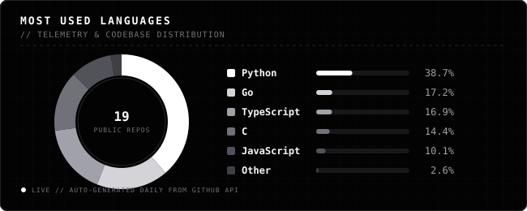

<h1 align="center">
  
</h1>

  <code>AI/ML SYSTEMS</code> &nbsp;•&nbsp; <code>HIGH-PERFORMANCE BACKENDS</code> &nbsp;•&nbsp; <code>CONCURRENT ARCHITECTURES</code>

  
  

  <a href="#profile">Profile</a> •
  <a href="#telemetry-statistics">Telemetry</a> •
  <a href="#language-distribution">Languages</a> •
  <a href="#selected-systems">Systems</a> •
  <a href="#writing">Writing</a> •
  <a href="#architecture--domains">Stack</a> •
  <a href="#terminal-connections">Connections</a>

---

## Profile

> *I bridge the gap between autonomous deep learning systems and high-performance backend pipelines.*

I am an engineer specializing in **AI/ML systems** and **backend infrastructure**. My work focuses on training specialized transformer architectures, optimizing inference pipelines, and designing high-throughput concurrent backend systems.

- ⚡ **Focus Areas**: Deep Learning Architecture, Distributed Systems, Low-Latency Networking
- 🧠 **Research & Dev**: Custom Transformer Pipelines, C++ CUDA Accelerators, Go Microservices
- 🛠️ **Design Philosophy**: Minimalist, High-Performance, Mathematically Rigorous
- ✍️ **Writing**: Contributor at [The Learning Curve](https://thelearningcurvenjack.substack.com), the tech magazine run by NJACK, IIT Patna

---

## Telemetry Statistics

  

  

---

## Language Distribution

  

  
  

---

## Selected Systems

| System | What it is | Stack |
| :-- | :-- | :-- |
| [**devRAG**](https://github.com/6sLOGAN78/devRAG) | Enterprise RAG with hybrid BM25 + dense retrieval, reranking, tenant isolation and RBAC | `Go` `Python` |
| [**RedrobRanker**](https://github.com/6sLOGAN78/RedrobRanker) | CPU-optimized 11-stage candidate ranking engine: BM25 + FAISS, cross-encoder reranking, local LLM rationales | `Python` |
| [**NetSure**](https://github.com/6sLOGAN78/NetSure) | Network intrusion detection pipeline on CICIDS2017 with DVC, MLflow and Optuna-tuned XGBoost | `Python` `Docker` |
| [**SiLabs**](https://github.com/6sLOGAN78/SiLabs) | EFR32/ESP32 ICU telemetry with a stacking meta neural network for triage | `C` |
| [**protask**](https://github.com/6sLOGAN78/protask) | Task management on a Go (Echo) REST API with PostgreSQL, Redis queues and a React SPA | `Go` `TypeScript` |
| [**show-its-work**](https://github.com/6sLOGAN78/show-its-work) | Deterministic KPI diagnosis engine where the LLM never computes a number | `Python` |

---

## Writing

I write for [**The Learning Curve**](https://thelearningcurvenjack.substack.com), the Substack tech magazine run by NJACK, the computing club of IIT Patna.

<!-- SUBSTACK:START -->
- <a href="https://thelearningcurvenjack.substack.com/p/robotics-step-one"><b>Robotics, Step One</b></a>
<!-- SUBSTACK:END -->

  

---

## Architecture & Domains

### THE THEORETICAL

  
  
  

### THE TACTICAL

  
  
  
  
  
  
  
  
  

### THE ORCHESTRATION

  
  
  
  
  
  
  

---

## Terminal Connections

  

